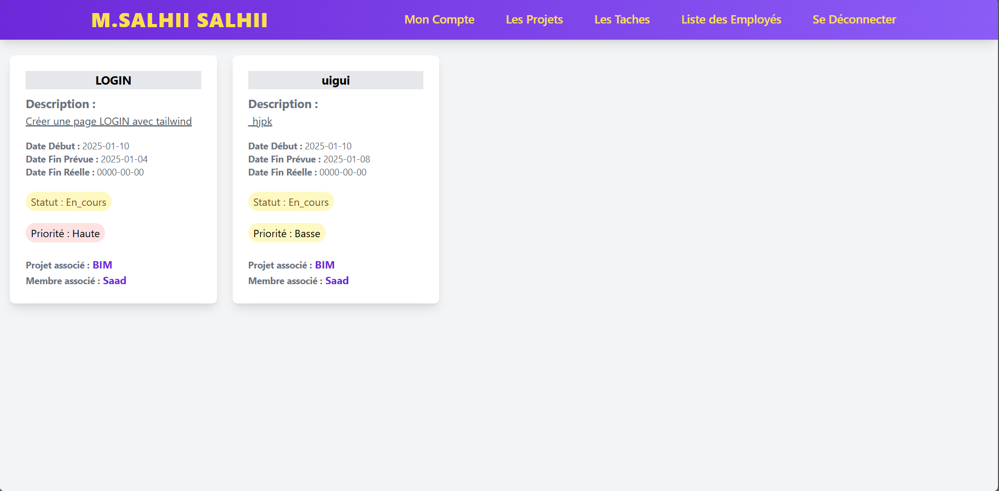
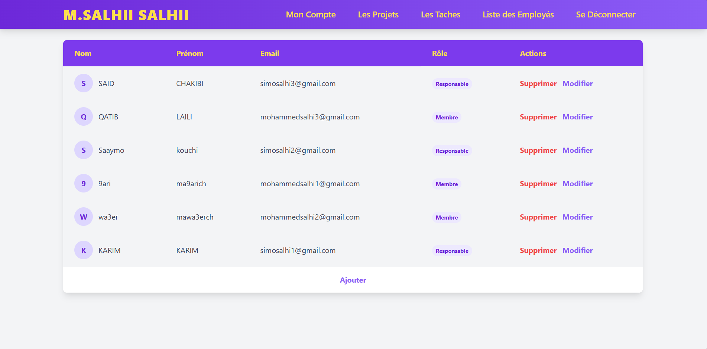
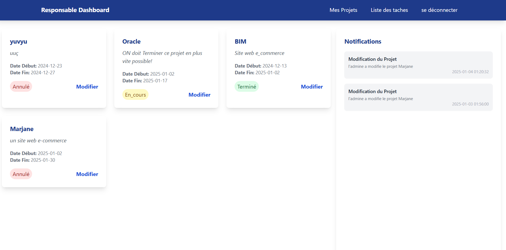
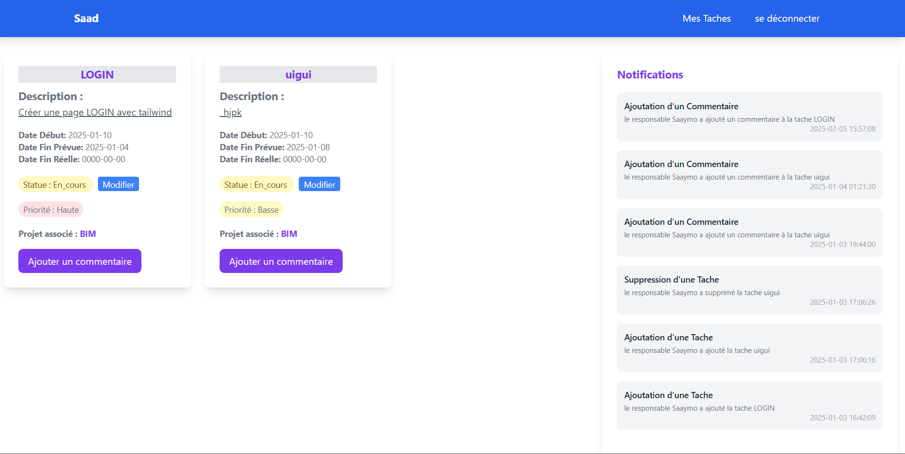

# 📁 Project Management System

This is a web-based **project and task management platform** built with **PHP**, **MySQL**, and **TailwindCSS**. It enables teams to collaborate on projects, assign tasks, manage roles and permissions, comment on tasks, and track project progress with notification support.

---

## 🌟 Core Features

### 👤 User Management
- Register users with roles: `Administrator`, `Responsible`, `Member`
- Login system with hashed passwords
- Role-based access to functionalities

### 📁 Project Management
- Create, update, and delete projects
- Each project has: name, description, start date, expected end date, status, and a responsible user
- Project statuses: `En_cours`, `Terminé`, `Annulé`, `Suspendue`

### ✅ Task Management
- Add tasks under a specific project
- Attributes: name, description, start date, expected/real end date, status, priority, assigned user
- Task statuses: `A_faire`, `En_cours`, `Terminé`, `Bloquée`
- Task priorities: `Haute`, `Moyenne`, `Basse`

### 💬 Comment System
- Users (membres & managers) can comment on any task
- Each comment is timestamped and linked to a user and a task

### 🔔 Notifications
- System generates notifications for actions:
  - Task creation, deletion, updates
  - Project modifications
  - Comments added
- Each notification stores: title, content, date, related task, and the creator

---

## 🧱 Database Overview

### Tables:
- **`utilisateur`**: stores users (id, name, email, password, role)
- **`projet`**: projects with status and responsible user
- **`tache`**: tasks assigned to projects and users
- **`commentaire`**: task-related comments by users
- **`notification`**: records changes and alerts users

> See the file [`gestion_de_projet.sql`](gestion_de_projet.sql) for the full schema.

---

## 🛠️ Technologies

- **Backend**: PHP (native)
- **Frontend**: TailwindCSS
- **Database**: MySQL (MariaDB-compatible)

---

## ⚙️ Setup Instructions

### 1. Clone the repository

git clone https://github.com/your-username/project-management-system.git
cd project-management-system

### 2. Import the database

mysql -u root -p gestion_de_projet < gestion_de_projet.sql

## 👤 Author
**Mohammed Salhi** - [Send me an email](https://mail.google.com/mail/?view=cm&fs=1&to=mohammedsalhisam@gmail.com&su=Inquiry%20about%20Project%20Management%20System)

## 📸Screenshots : 

